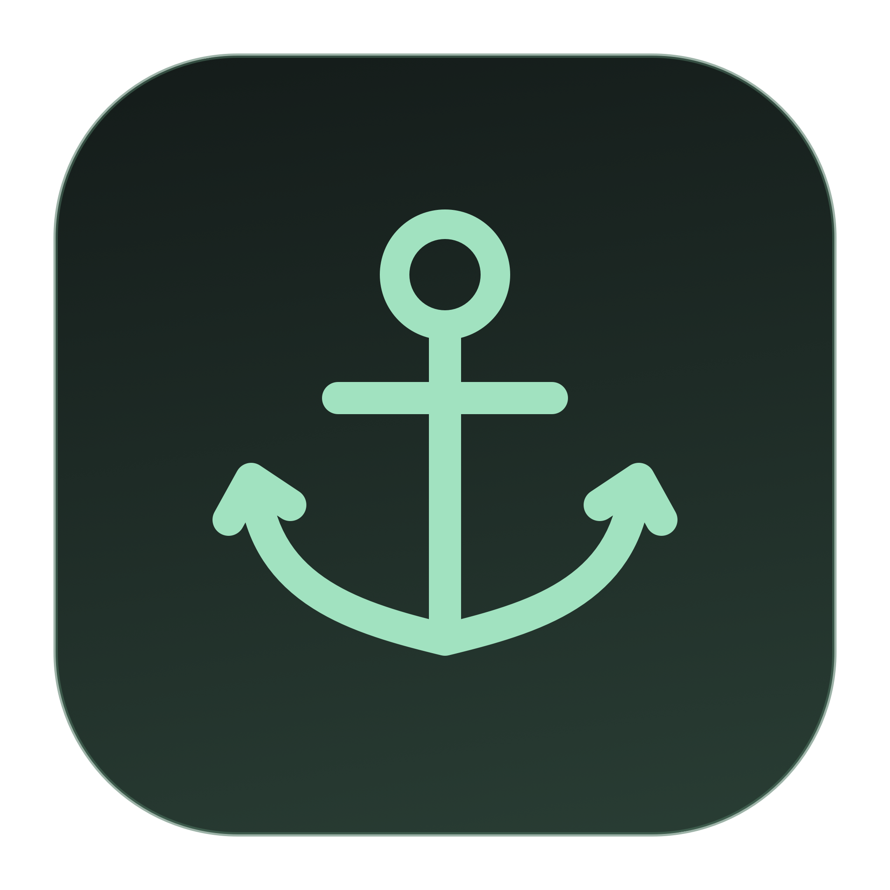
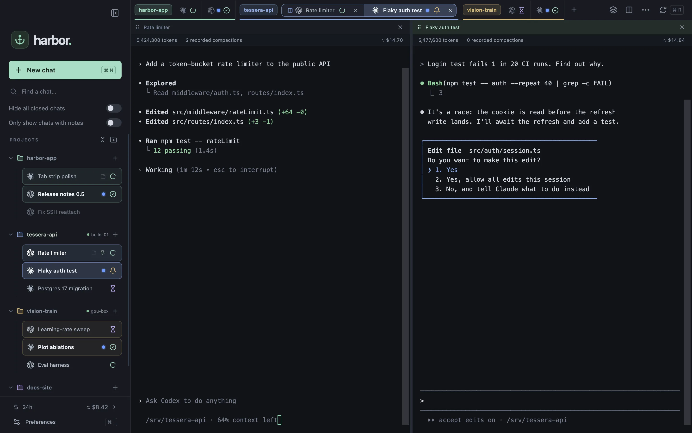
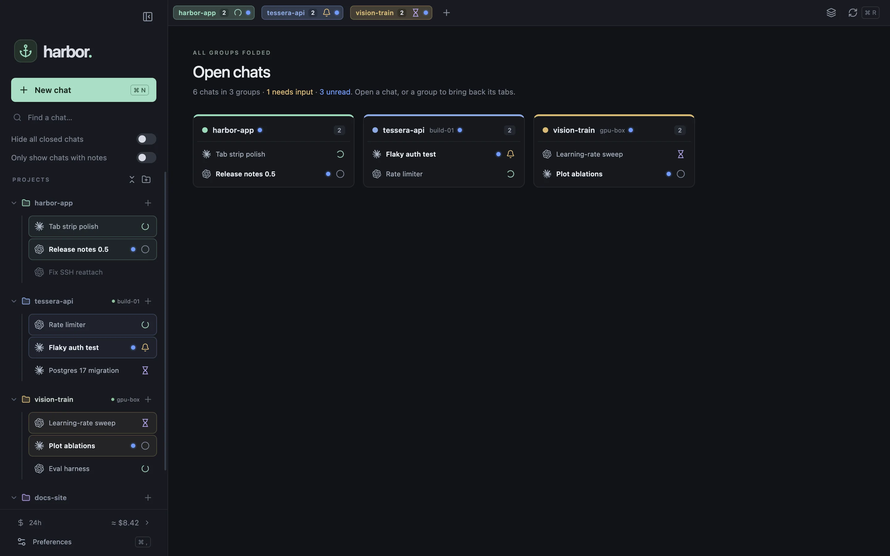
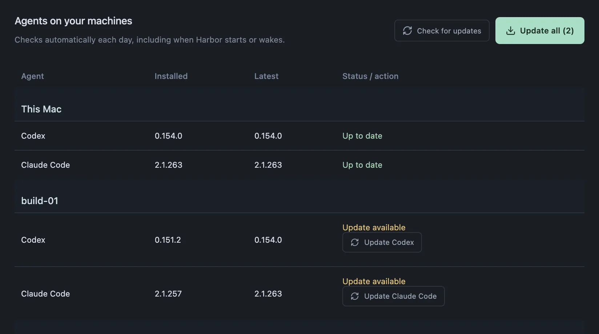
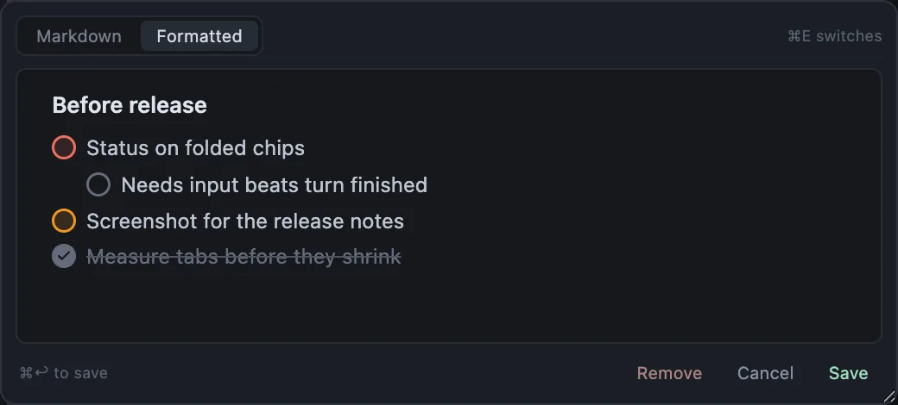
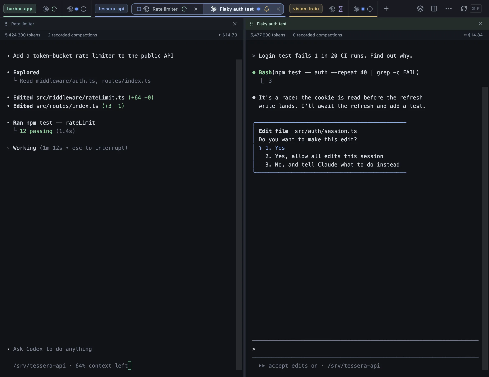

<p align="center">
  
</p>

<h1 align="center">Harbor</h1>

<p align="center">
  <b>Stop juggling tmux sessions.</b><br>
  A calm macOS home for your Codex, Claude Code and terminal chats, on your Mac and over SSH.
</p>

<p align="center">
  <a href="https://github.com/Syzygianinfern0/harbor-app/actions/workflows/ci.yml"></a>
  
  <a href="https://github.com/Syzygianinfern0/harbor-app/releases/latest"></a>
  <a href="LICENSE"></a>
</p>

<p align="center">
  <a href="https://spsharan.com/harbor-app/">Website</a> ·
  <a href="#install">Install</a> ·
  <a href="docs/user-guide.md">User guide</a> ·
  <a href="CONTRIBUTING.md">Contributing</a>
</p>



## Why Harbor

If you run agents across many projects, use both Codex and Claude Code, work on your Mac and on remote machines, and hand work off so you can step away, you know the routine: `ssh`, `cd`, `tmux new`, start the agent, repeat. Then `tmux ls` and guess which of eleven sessions needed you.

Harbor replaces that routine. Every chat runs in tmux on its own machine and Harbor just attaches, so quitting the app, losing Wi-Fi or closing the lid never stops an agent. Each chat shows what it is doing, and Harbor tells you when one needs you.

## Highlights

- **Projects on any machine.** Pick a folder on your Mac or any SSH host from `~/.ssh/config`; Harbor finds the Codex and Claude conversations already there, including ones started outside Harbor.
- **Chats that survive anything.** tmux keeps every agent running on its host. Reconnects reattach without restarting the agent, and closed chats resume their exact conversation.
- **Live status.** Working, needs input, waiting on background work, turn finished, or error, read from the agents themselves rather than guessed from the screen. Desktop notifications, unread dots and <kbd>⌘</kbd> <kbd>J</kbd> take you to the chat that needs you.
- **Tabs like your browser.** Group tabs by project or by hand, fold groups away, split panes side by side, or use focus mode.
- **The small things.** Fork a chat, attach Markdown notes with to-dos, search scrollback, drag files onto a chat (copied to the remote host for SSH chats), see per-chat token and cost estimates, and update Codex and Claude Code on every machine from one place.

<table>
  <tr>
    <td width="50%"></td>
    <td width="50%"></td>
  </tr>
  <tr>
    <td align="center">Fold groups away; the overview shows what needs you.</td>
    <td align="center">Keep Codex and Claude Code current on every machine.</td>
  </tr>
  <tr>
    <td></td>
    <td></td>
  </tr>
  <tr>
    <td align="center">Notes and to-dos on any chat or project.</td>
    <td align="center">Codex, Claude Code or a plain terminal, with your permission mode.</td>
  </tr>
</table>

## Install

Run this in Terminal:

```sh
curl -fsSL https://spsharan.com/harbor-app/install.sh | bash
```

It downloads the latest release, checks it, puts Harbor in your Applications folder and opens it. Then click **Add project**, pick a machine and a folder, and press <kbd>⌘</kbd> <kbd>N</kbd> to start a chat.

Prefer a download? Get the `.dmg` from [Releases](https://github.com/Syzygianinfern0/harbor-app/releases/latest). Harbor is not notarized by Apple, so the first launch of a downloaded copy is blocked: open **System Settings → Privacy & Security** and click **Open Anyway**. The install command doesn't need that step.

Harbor keeps itself up to date: it downloads new releases in the background and installs them when you click **Restart to update** or next quit it. Your chats keep running in tmux throughout.

To use remote machines, add them under **Settings → Remotes** (import from your SSH config or enter them by hand).

### Requirements

- macOS on Apple Silicon.
- On every machine you use, including your Mac: tmux 3.2+, Python 3.8+, bash, and a POSIX login shell (`brew install tmux` on a Mac).
- Codex and/or Claude Code, installed and signed in on the machines where you use them. Harbor is tested with Codex 0.154 and Claude Code 2.1.
- For remote machines, SSH that connects without prompts (`ssh your-host` works in Terminal). Harbor uses your system SSH and its config, keys, agent and jump hosts.

## Privacy

Harbor has no account, server, or telemetry. Your projects, chat names and notes are stored on your Mac in `~/Library/Application Support/Harbor/`. Conversations stay with Codex and Claude Code on their own machines; Harbor reads their local history and status through a small Python script it installs under `~/.local/share/harbor/` on each host. The only network requests Harbor makes itself are SSH connections you configure, Harbor and agent version checks, release downloads from GitHub, and a daily download of public model prices for cost estimates.

## Documentation

- [User guide](docs/user-guide.md): every feature, shortcut and preference.
- [How Harbor works](docs/architecture.md): tmux, the host adapter, status detection, storage and usage accounting.
- [Contributing](CONTRIBUTING.md), [validating changes](VALIDATION.md), and [AGENTS.md](AGENTS.md) for coding agents.

## Contributing

Bug reports, ideas and pull requests are welcome. [CONTRIBUTING.md](CONTRIBUTING.md) covers setup (`npm ci && npm run dev:sandbox`), tests, and the pull request flow. Much of Harbor is built with coding agents, and the repo is set up for yours.

## License

[MIT](LICENSE)
